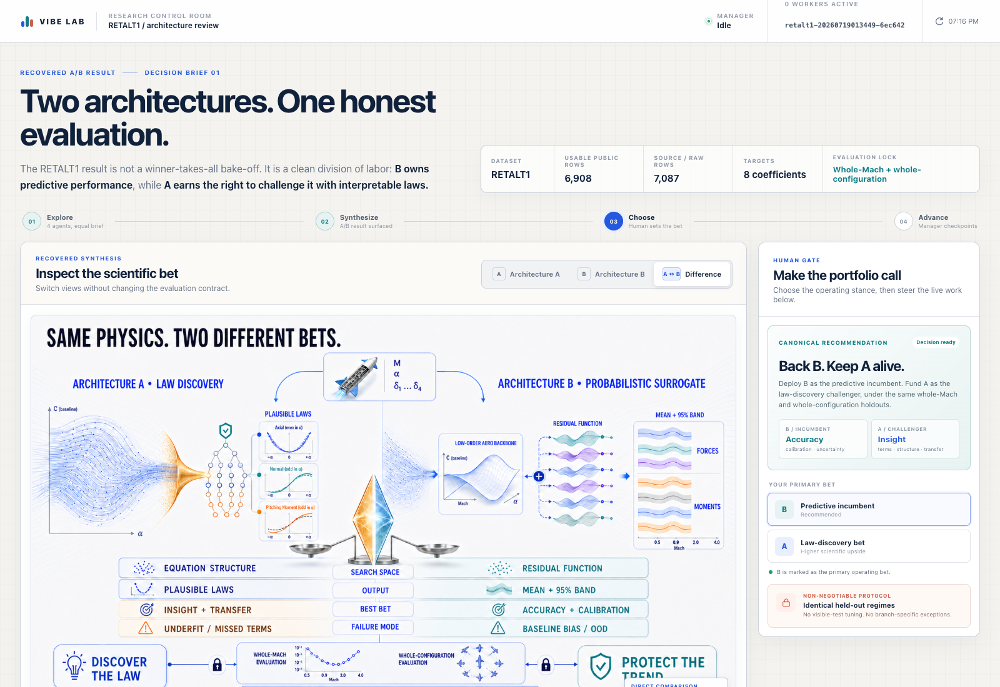
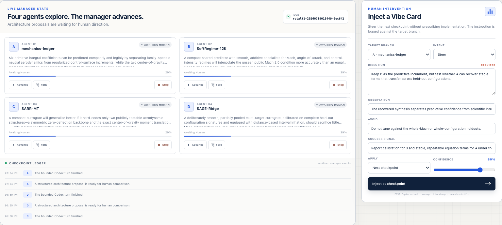
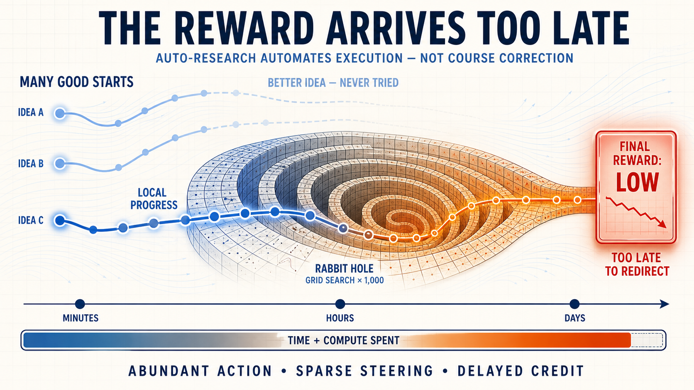
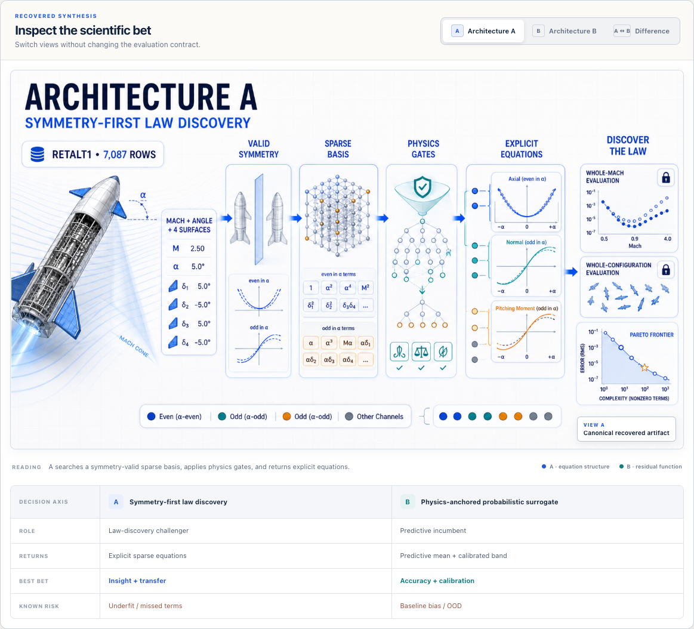
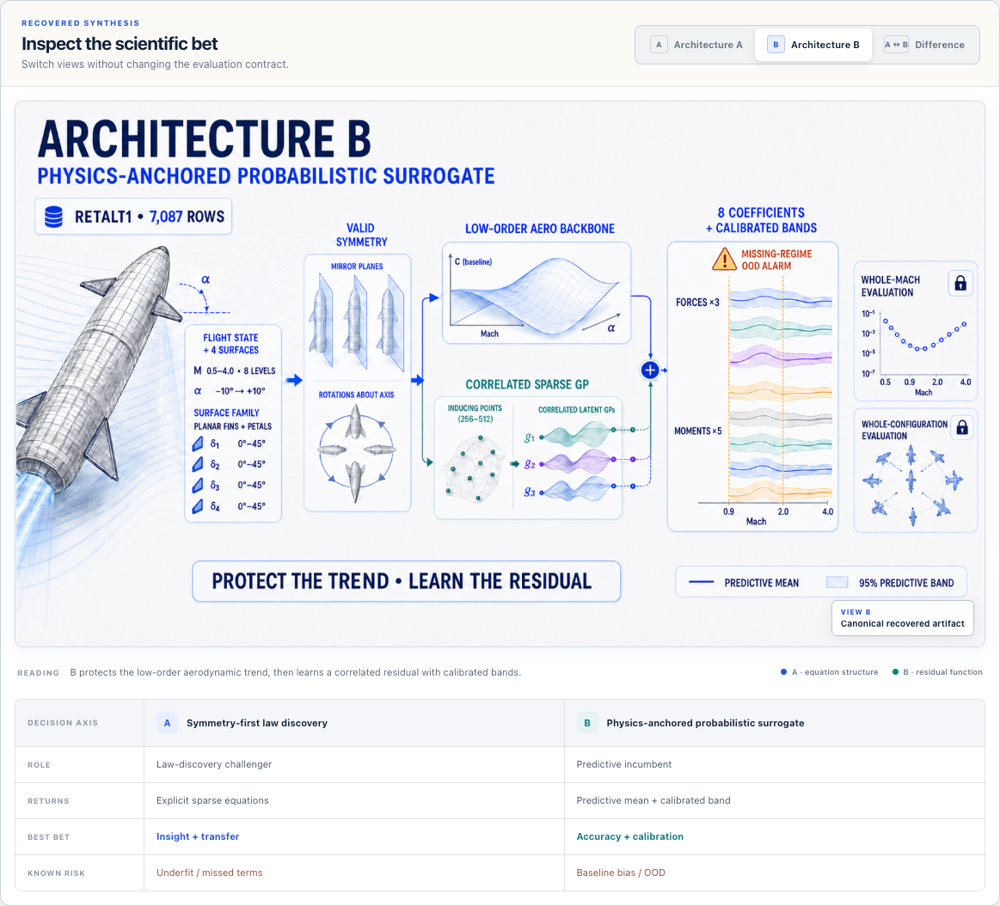

# Sci Vibes

**Human-steered auto-research for scientific model discovery.**

Sci Vibes starts with a scientific problem and a locked evaluation contract,
launches multiple Codex research branches against the same evidence, and brings
their strongest disagreements back to a person as an A/B decision.

The person does not have to supervise every implementation detail. They choose
which scientific bets deserve more compute, inject a structured **Vibe Card**,
fork a promising direction, or stop a branch. The research manager records the
decision, advances the selected work, and keeps evaluation separate from the
agents proposing solutions.

<p align="center">
  
</p>

## The auto-research loop

1. **Start with the problem.** Define the scientific target, public data,
   metrics, constraints, and manager-only evaluation.
2. **Explore in parallel.** Four isolated Codex branches receive the same
   problem contract and develop materially different model architectures.
3. **Synthesize the disagreement.** The app turns long research proposals into
   short briefs and direct A/B diagrams.
4. **Put judgment back in the loop.** A person can advance, fork, stop, or steer
   a branch with a Vibe Card that states direction, evidence, things to avoid,
   and a success signal.
5. **Keep the comparison honest.** The manager preserves the common data,
   budget, and holdouts while maintaining a filesystem ledger of every public
   checkpoint.

<p align="center">
  
</p>

## Why the human gate appears early

Autonomous execution can generate a great deal of local progress while still
following the wrong research direction. If the only meaningful reward arrives
after a long training run, the system discovers the mistake after most of the
time and compute have already been spent.

Sci Vibes surfaces disagreements before that expensive commitment. Short briefs,
architecture diagrams, and explicit checkpoints let a person redirect the
search while alternatives are still cheap to try.

<p align="center">
  
</p>

## Demonstration: RETALT1 aerodynamic surrogate discovery

The included demonstration uses the public
[RETALT1 Aerodynamic Data Base 2.0](https://zenodo.org/records/7027367).
It asks the research system to predict eight integral aerodynamic coefficients
for a reusable launch vehicle:

`CA`, `CFy`, `CN`, `CMx`, `CMy`, `CMz`, `CMy_cog`, and `CMz_cog`.

The inputs describe Mach number, angle of attack, surface family and layout,
engine state, and four control-surface deflections. This is a compact
aerodynamic surrogate problem: the target is a set of force and moment
coefficients, not a mesh-resolved CFD field.

| Public contract | Rows | Curves | Purpose |
| --- | ---: | ---: | --- |
| Train | 4,408 | 109 | Model fitting and branch-local selection |
| Visible validation | 779 | 19 | Public comparison at a held-out Mach condition |
| Sealed evaluation | 1,721 | 42 | Manager-side whole-configuration evaluation |
| **Total usable** | **6,908** | **170** | Ingested coefficient rows |

The source architecture slides summarize 7,087 source rows; the executable data
contract exposes 6,908 usable rows after ingestion. Evaluation holds out whole
Mach regimes and whole configurations instead of randomly separating adjacent
rows from the same aerodynamic curve.

## The recovered A/B decision

The first research synthesis produced two different scientific bets under the
same data, budget, and holdouts.

### Architecture A — symmetry-first law discovery

Architecture A projects the data into symmetry-valid channels, searches a
sparse basis, rejects physically invalid terms, and returns explicit candidate
equations. Its upside is insight and transfer; its main risk is underfitting or
missing important interaction terms.

<p align="center">
  
</p>

### Architecture B — physics-anchored probabilistic surrogate

Architecture B combines a low-order aerodynamic backbone with a correlated
sparse Gaussian-process residual. It returns predictive means, calibrated
bands, and out-of-distribution warnings. Its upside is accuracy and calibration;
its main risk is baseline bias outside supported regimes.

<p align="center">
  
</p>

The portfolio decision is to run **B as the predictive incumbent** and keep
**A as the law-discovery challenger**. Both must pass the same whole-Mach and
whole-configuration tests.

## How it is built

- **SvelteKit control room** — renders the problem, metrics, architecture
  briefs, branch state, checkpoint ledger, and Vibe Card composer.
- **Filesystem research manager** — creates runs, provisions four isolated Git
  repositories, launches Codex workers, and processes control commands.
- **Whole-repository branches** — every direction owns its implementation
  workspace instead of proposing changes as comments on one shared tree.
- **Structured research contract** — each proposer returns a machine-validated
  architecture, training plan, inductive biases, risks, falsification tests,
  and human questions.
- **Modal data and evaluation jobs** — prepare the public RETALT1 splits and
  keep the sealed scoring path on manager-controlled infrastructure.
- **Local provenance** — public state, commands, events, proposals, and branch
  repositories live under `runs/`.

## Run it

Requirements:

- Node.js 20.19+ (or 22.12+)
- A signed-in Codex installation/subscription for live research branches
- Modal CLI access when preparing the RETALT1 dataset

Install dependencies:

```bash
npm install
```

Prepare the public dataset:

```bash
modal run modal_jobs/retalt_dataset.py
mkdir -p data/retalt1
modal volume get sci-vibes-retalt1-v1 public/train.csv data/retalt1/train.csv
modal volume get sci-vibes-retalt1-v1 public/validation.csv data/retalt1/validation.csv
modal volume get sci-vibes-retalt1-v1 public/manifest.json data/retalt1/manifest.json
```

Start the SvelteKit app and research manager together:

```bash
scripts/dev-server.sh start
```

The command prints the checkout-specific local URL. From the app, start four
branches, compare their proposals, and inject a Vibe Card at the human gate.

Useful checks:

```bash
npm run check
npm run build
```

## Repository map

```text
src/routes/+page.svelte          desktop research control room
src/routes/api/                  sanitized state and control endpoints
scripts/research-manager.mjs     filesystem run manager
scripts/lib/                     Codex runner and atomic run store
research/branch-template/        problem and evaluation contract copied to branches
research/schemas/                structured proposal schema
modal/                           RETALT1 ingestion and sealed evaluator
static/architecture-slides/      generated A/B scientific diagrams and prompts
docs/screenshots/                live app captures used in this README
```

Downloaded data, run repositories, raw agent logs, and temporary files remain
local under `data/`, `runs/`, and `tmp/`; those directories are ignored by Git.

## License

[MIT](LICENSE)
