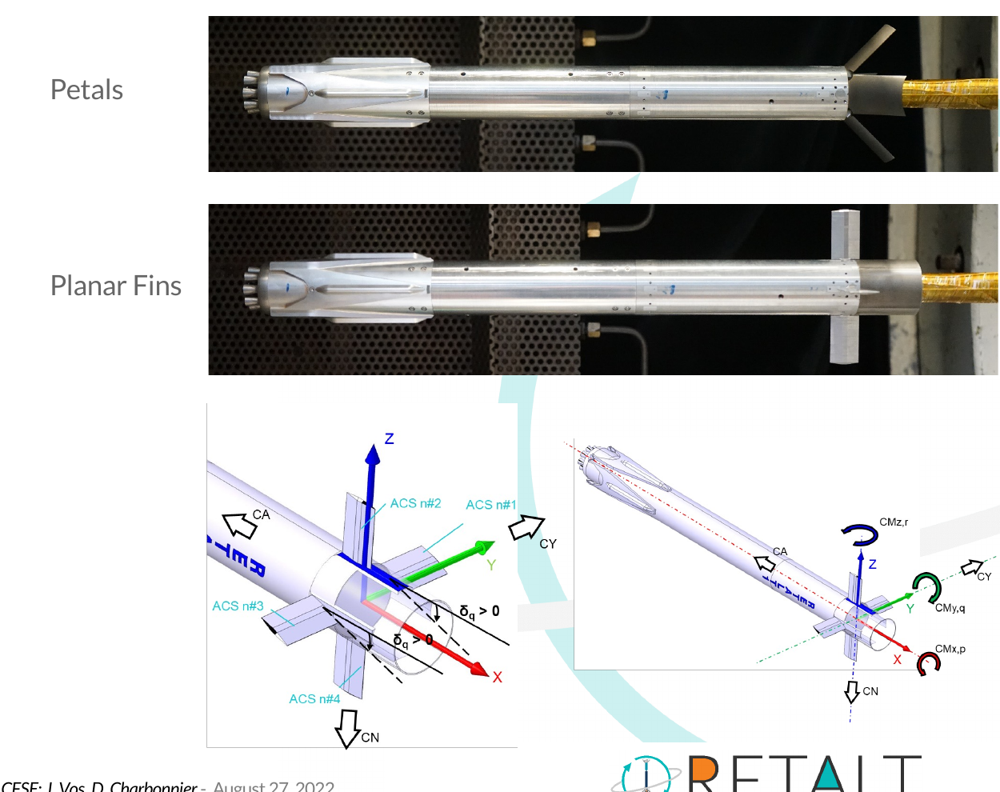
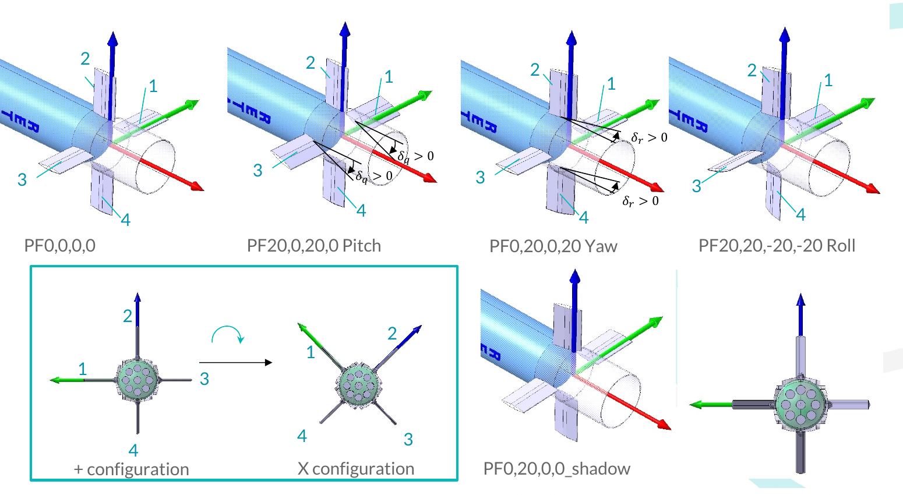
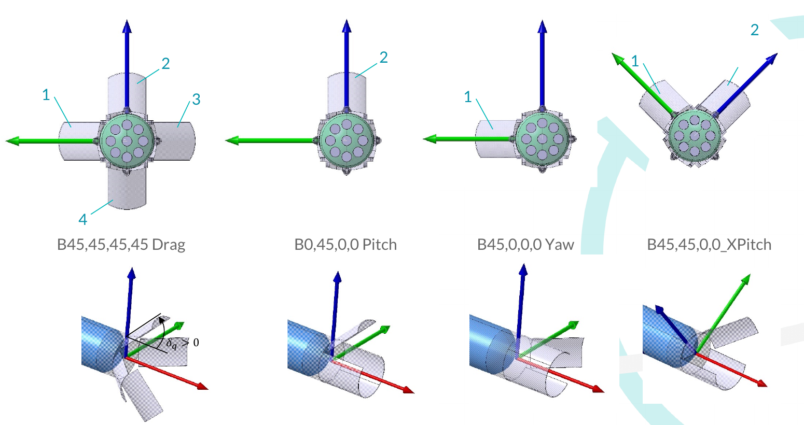
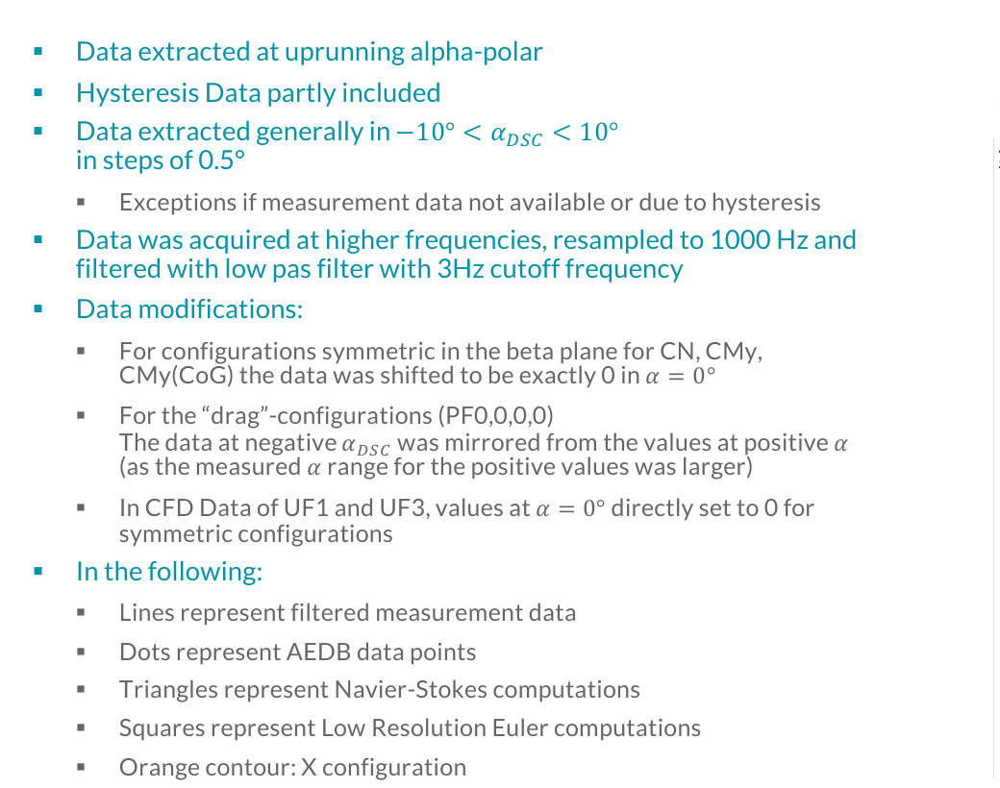
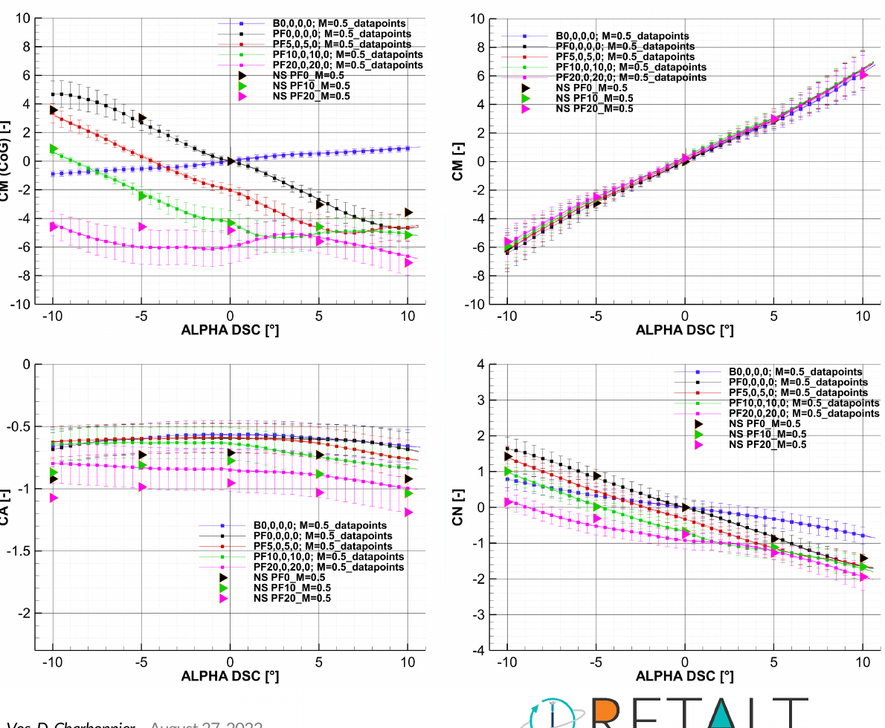

<!-- Render with Marp HTML enabled because the slide layout uses HTML grid containers. -->

# RETALT1 demo problem
## Predict the aerodynamic loads of a control-surface configuration the model has never seen

  

    
  

  

    

      
    

    

      
    

  

  <strong>Inputs:</strong> Mach, angle of attack, surface family and layout, and four surface deflections.
  <strong>Outputs:</strong> three force coefficients and five moment coefficients.

  The benchmark asks for generalization across <strong>entire unseen control-surface configurations</strong> - not a CFD field and not a nearby-row interpolation.

  Source figures: RETALT1 DLR/CFSE AEDB2.0 Description (2022-08-26), pp. 6, 7 and 9. CC BY 4.0.

---

# The data is 170 polars - not 6,908 independent rows
## Adjacent angle-of-attack samples belong to the same processed aerodynamic curve

  

    
  

  

    
  

  
<strong>Train</strong>4,408 rows - 109 curves

  
<strong>Visible validation</strong>779 rows - 19 complete Mach 2.5 curves

  
<strong>Sealed evaluation</strong>1,721 rows - 42 curves - 7 unseen configurations

  Never random-split neighboring α rows. Hold out <strong>whole Mach curves</strong> and test on <strong>whole configurations</strong>.

  Source figures: RETALT1 DLR/CFSE AEDB2.0 Description (2022-08-26), pp. 10 and 14. Split counts: data/retalt1/manifest.json.

